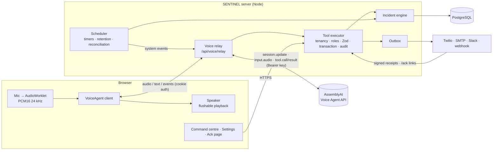

# SENTINEL

**A voice-operated incident response system. It turns a messy spoken report into structured, evidence-backed action.**

Built for the AssemblyAI Voice Agent Hackathon on the [AssemblyAI Voice Agent API](https://www.assemblyai.com/docs/voice-agents/voice-agent-api), SvelteKit 5, PostgreSQL and Drizzle, and hardened for production use: accounts and roles, organisations, a tamper-evident audit trail, real notifications, server-side timers and a server-side voice relay.

> SENTINEL doesn't just understand what you said. It turns what you said into accountable action, and it can show you where every fact came from.

---

## The problem

The first minutes of an incident matter most, and they are also the messiest. Someone tells a manager, someone scribbles notes, someone phones maintenance. Details get lost and follow-ups get dropped. The report written afterwards contains guesses presented as facts, and nobody can say who said what, or when.

## The solution

You press **Start incident** and talk. SENTINEL, running on the AssemblyAI Voice Agent API:

1. **Listens** to a natural spoken report, with no form filling.
2. **Extracts facts with provenance.** Each fact records its source, the exact words it came from, who said them, its timestamp, its precision and its verification state.
3. **Keeps uncertainty.** "About twenty minutes ago" stays approximate. "The display says twelve degrees" is stored as _stated but unverified_. Inferences are labelled as inferences, and sensor readings as sensor readings.
4. **Knows what it doesn't know.** A per-incident-type checklist makes unknowns first-class, so SENTINEL asks only the next most useful question.
5. **Creates and tracks actions,** each with a status, owner, contact and response timer.
6. **Reaches people for real.** It sends SMS, phone calls, email, Slack or a webhook, depending on each contact's channel. A one-time link lets them acknowledge without an account. Status is shown honestly: queued → sent → delivered or failed.
7. **Escalates** when a contact doesn't respond. Timers run on the server, so escalation happens even with every screen closed.
8. **Keeps a hash-chained evidence timeline** that the database refuses to edit, and re-verifies it on every view.
9. **Compiles an incident report** deterministically from the database. No LLM "remembers" the incident.

Corrections never erase history. If the reporter re-checks and says "actually, it's 13.4 degrees", the 12°C reading is kept as **superseded** and 13.4°C becomes **current + confirmed**, with both quotes on record.

## Why voice, and why AssemblyAI

The person who sees the incident is usually standing in front of it, with their hands full, stressed, and without time for a form. Speech is how they already report it. The hard part is turning that speech into something accountable, and that is what SENTINEL adds.

The AssemblyAI Voice Agent API is the right foundation because one WebSocket provides the whole conversational loop: streaming STT, **semantic turn detection**, **semantic barge-in** ("uh-huh" doesn't interrupt, "wait, stop" does), an LLM with **tool calling**, and TTS. SENTINEL's value sits in the tools. Every tool call becomes validated, persisted, auditable state.

**Documentation:** [Architecture](docs/ARCHITECTURE.md) · [Security](docs/SECURITY.md) · [Operations](docs/OPERATIONS.md) · [Real AssemblyAI validation](docs/REAL_ASSEMBLYAI_VALIDATION.md) · [Voice agent evaluation](docs/VOICE_AGENT_EVALUATION.md) · [Demo runbook](docs/DEMO_RUNBOOK.md) · [90-second script](DEMO_SCRIPT.md)

---

## What is real, simulated, or not implemented

| Real                                                                                                                           | Simulated (demo organisation only, always labelled)             | Not implemented                                                          |
| ------------------------------------------------------------------------------------------------------------------------------ | --------------------------------------------------------------- | ------------------------------------------------------------------------ |
| AssemblyAI Voice Agent API via a server-side relay: STT, LLM, TTS, turn detection, barge-in, tool calling (**validated live**) | Replies from people outside the call (maintenance "calls back") | Speaking relay events across instances (per-process bus; see Operations) |
| Accounts, organisations, roles (reporter/coordinator/manager/admin), API keys                                                  | 30-second response timeout (real organisations set their own)   | SSO / OIDC (password accounts only)                                      |
| Notifications: Twilio SMS + calls with signed delivery receipts, SMTP email, Slack, signed webhook, ack links                  | Fictional demo organisation, people and history                 | Multilingual reporting                                                   |
| Server-side escalation timers, outbox, reconciliation, retention (leader-elected scheduler)                                    |                                                                 | Offline data entry (offline shows a notice; nothing is cached)           |
| Hash-chained, append-only audit trail (database triggers) with live verification                                               |                                                                 |                                                                          |
| Photo evidence, sensor API (`observed` facts), export, redaction, encryption at rest, consent                                  |                                                                 |                                                                          |
| Fact provenance, supersession, confirmation, unknowns; state machines; explainable severity; deterministic report              |                                                                 |                                                                          |

Every contact and escalation shows its real notification status: `queued`, `sent`, `delivered`, `failed`, `not_configured` (no channel, so staff must call) or `simulated` (demo). Nothing is shown as "sent" before a provider accepted it.

---

## Architecture



**The core loop:** voice → SENTINEL relay → AssemblyAI → `tool.call` → validated incident state (Postgres) → voice response → action → real outreach → acknowledgement or escalation.

### Code layout

```
src/lib/domain/          Pure, tested domain logic (types, state machine, evidence, severity,
                         playbooks, escalation, org policy, report, replay)
src/lib/server/
  auth/                  Passwords (scrypt), sessions, roles, tool permissions, API keys
  db/                    Drizzle schema + triggers, dual driver (pg / PGlite), encryption at rest
  tools/                 14 tool schemas (Zod → JSON Schema), handlers, executor
  incidents/             Repository, engine, hash-chained audit trail, views
  voice/                 Server-side relay, WebSocket upgrade handler, in-process event bus
  assemblyai/            Prompt and tiered tools, voice sessions and quotas, reconciliation
  notifications/         Providers (Twilio, SMTP, Slack, webhook) and the outbox
  jobs/                  Leader-elected scheduler, retention
  observability.ts       JSON logs and Prometheus metrics
src/lib/voice/           Browser client (relay protocol), audio engine, capture worklet
src/routes/              Pages (incident, settings, login, setup, ack) + /api endpoints
server/index.js          Production entry: SvelteKit handler + relay WebSocket + graceful shutdown
scripts/                 e2e, live voice/browser/resume harnesses, load + chaos test, DB CLI
```

---

## AssemblyAI integration

Everything below was checked against the current AssemblyAI docs before implementation and validated against the live service.

| Concern                       | How SENTINEL does it                                                                                                                                                                                                                                                                                |
| ----------------------------- | --------------------------------------------------------------------------------------------------------------------------------------------------------------------------------------------------------------------------------------------------------------------------------------------------- |
| Product                       | **Voice Agent API**: managed full-duplex speech-in/speech-out with tool calling.                                                                                                                                                                                                                    |
| Auth                          | The SENTINEL server opens `wss://agents.assemblyai.com/v1/ws` with `Authorization: Bearer <key>`. Browsers talk only to SENTINEL's relay (same origin, cookie session) and never receive the key or any AssemblyAI token.                                                                           |
| Configuration                 | Inline `session.update`: `system_prompt` (embeds the live incident record), `greeting`, `output.voice` (validated against the documented list), `input.keyterms`, `input.transcription_prompt`, `input.voice_focus`, `tools`. Immutable fields are sent only on the first update.                   |
| Tools                         | Flat function-tool schema generated from the same Zod schemas the server validates with. Before an incident exists only `create_incident` is exposed; afterwards the response-phase tools (≤12).                                                                                                    |
| Tool results                  | The relay executes `tool.call` on the server, holds the result until `reply.done` is the latest event, then sends `tool.result` (`is_error` on failure). On `reply.done status:"interrupted"` pending results are dropped, as documented. Tools are idempotent.                                     |
| Barge-in                      | The browser flushes queued audio instantly on `reply.done status:"interrupted"`; interrupted replies are marked in the transcript.                                                                                                                                                                  |
| System events and typed input | Escalations, delivery receipts, acknowledgements and sensor readings are announced via `conversation.message` (system) + `reply.create` instructions. Typed input also travels in `reply.create` instructions: live testing showed a user-role `conversation.message` is not seen by the agent.     |
| Lifecycle                     | `session.end` on user end, page close, max duration (30 min), shutdown, and whenever the browser disconnects, so there is no idle billing.                                                                                                                                                          |
| Reconnect                     | `session.resume` is attempted, but the live service rejected it in every test (see [support report draft](docs/ASSEMBLYAI_SUPPORT_REPORT.md)). SENTINEL then opens a fresh session on the same incident with the prompt rebuilt from the database.                                                  |
| Reconciliation                | After a session ends, `GET /v1/sessions/{id}` is compared with SENTINEL's record, and AssemblyAI's per-turn `user_confidence` is stored on each utterance and shown in the provenance drawer. The recording can be played through a fresh pre-signed URL; retention can `DELETE /v1/sessions/{id}`. |

`agent_context` is a Streaming STT parameter, not a Voice Agent API field, so it isn't used. The `llm` (bring-your-own model) field is documented for stored agents only, so SENTINEL doesn't send it inline.

---

## Setup

Requirements: **Node.js ≥ 22.12** and npm. You don't need a separate database for local use.

```bash
npm install
cp .env.example .env         # set ASSEMBLYAI_API_KEY (and DEMO_LOGIN_ENABLED=true for the demo)
npm run dev                  # http://localhost:5173
```

On first start, migrations run and the fictional demo organisation is seeded. Open the app and either:

- **create your organisation** at `/setup`, which is only available until the first account exists, or
- with `DEMO_LOGIN_ENABLED=true`, choose **Continue with demo** to enter the fictional Golden Fork organisation.

Production: `docker compose up --build`, or `npm run build && npm start`. See [docs/OPERATIONS.md](docs/OPERATIONS.md) for deployment, notification channels, sensors, monitoring and scaling. `.env.example` documents every variable.

### Database

- **Zero-setup:** leave `DATABASE_URL` empty. SENTINEL runs a real PostgreSQL engine (PGlite, WASM) in-process, persisted under `.data/pglite` (single process only).
- **PostgreSQL:** set `DATABASE_URL`, or use `docker compose`, which includes Postgres 17.
- Commands: `npm run db:migrate` · `npm run db:seed` · `npm run db:reset` · `npm run db:generate`. With PGlite, stop the app first.

---

## Demo walkthrough

See **[DEMO_SCRIPT.md](DEMO_SCRIPT.md)** and **[docs/DEMO_RUNBOOK.md](docs/DEMO_RUNBOOK.md)**. In short, sign in with **Continue with demo**, then:

1. **Run live demo** → **Start incident** → accept the recording notice. SENTINEL: _"I'm listening. Tell me what happened."_
2. Report it messily. INC-0042 appears with 12°C **unverified**, start time **approximate**, HIGH with reasons, and the unknowns listed.
3. Talk over SENTINEL: "Wait, stop, I already moved the food." It stops mid-sentence and the action becomes **completed**.
4. "Please get maintenance on it." After 30 s with no reply, the server escalates to Maya Win (**demo simulation**) and SENTINEL says so.
5. "Actually, I checked again, thirteen point four." 12°C is **superseded**, 13.4°C **confirmed**.
6. "Generate the incident report." → **View report** or **Replay**. The timeline shows **chain verified**.

---

## Testing

```bash
npm run check        # svelte-check / TypeScript
npm test             # unit + integration (Vitest, real PostgreSQL via PGlite)
npm run test:e2e     # production build + browser e2e through the relay with a mock agent
npm run lint
node scripts/load-relay.mjs [--sessions 25] [--seconds 30] [--chaos]   # after npm run build
```

- **Unit** (`domain.spec.ts`): severity, state transitions, certainty, evidence matching, supersession, escalation rules, checklist, report.
- **Integration** (`tools.integration.spec.ts`, `postgres-driver.integration.spec.ts`): the full scenario through the executor on real PostgreSQL, over both drivers.
- **Production** (`production.integration.spec.ts`, 21 tests): passwords, sessions and API keys; role enforcement; tenancy isolation; hash chain verification and tamper detection; database triggers; outbox statuses with mocked Twilio (queued → sent → delivered, and failure); ack tokens; Twilio signatures; server-side escalation; retention; reconciliation matching; sensor facts; the shared rate limiter; and the **voice relay** against an in-process mock of the Voice Agent API.
- **End-to-end** (`scripts/e2e-inprocess.mjs --voice-mock`, 43 steps): first-run setup, sign-in, roles, tenancy, a **real signed webhook notification and its one-time acknowledgement link**, the sensor API, photos, audit verification, export, demo reset, then real Chromium through the relay. The browser part covers consent, streaming, tool execution and ordering, progressive tools, provenance, barge-in, typed input, the server-side 30 s escalation, upstream drop → fresh session, clean end, responsive layouts, and proof that the browser never contacts AssemblyAI.
- **Live** (billed to your key): `scripts/live-voice.mjs` (scripted scenarios, synthetic or recorded speech, `--min-pass-rate`), `scripts/live-browser.mjs` (real Chromium + relay + AssemblyAI), `scripts/live-resume.mjs` (resume probe). A nightly GitHub workflow runs the scenarios when an `ASSEMBLYAI_API_KEY` secret is set. Results: [docs/VOICE_AGENT_EVALUATION.md](docs/VOICE_AGENT_EVALUATION.md).

---

## Security

Summary. The full model is in [docs/SECURITY.md](docs/SECURITY.md).

- The AssemblyAI key never leaves the server, and the browser is not trusted with evidence: transcripts and tool calls are produced server-side by the relay.
- Accounts (scrypt), hashed session tokens, roles enforced on every tool call, strict organisation isolation, hashed revocable API keys.
- Hash-chained, append-only audit trail enforced by database triggers and verified live.
- Signed webhooks and signed Twilio receipts, one-time hashed acknowledgement tokens, and an outbox that never claims a message it didn't send.
- Consent before recording, encryption at rest (`DATA_ENCRYPTION_KEY`), retention and redaction, full export, content-checked photos, and a service worker that never caches incident data.
- Shared rate limits, strict validation, security headers, per-organisation voice quotas.

## Limitations (honest)

- **Live-validated, not field-proven.** The relay was validated against the real service with synthetic TTS voices and a real-browser run; see [docs/REAL_ASSEMBLYAI_VALIDATION.md](docs/REAL_ASSEMBLYAI_VALIDATION.md). Real human voices, accents and noisy rooms still need recorded-audio scenarios and a human rehearsal. The LLM is non-deterministic.
- **`session.resume` is rejected by the live service** in every attempt. The fallback keeps all data but loses the agent's short-term memory across a reconnect.
- **Notification providers are untested with live credentials** in this repository. Twilio, SMTP and Slack are implemented against their documented APIs and covered by mocked tests; the generic webhook path is exercised end-to-end. Verify each channel with your own account before relying on it.
- **Live-call announcements are per process.** With several instances, an event raised on another instance is recorded and shown but not spoken.
- Password accounts only (no SSO). Invites use a one-time password shown to the administrator; there is no email invite flow.
- Photos are stored in PostgreSQL (≤ 5 MB each). That suits modest volumes; move them to object storage at scale.
- Severity rules are deliberately simple triage aids, not a certified risk model. Quote matching is lexical.
- Browser testing covered Chromium. Firefox and Safari use the documented resampling pattern but were not tested.

## Roadmap

SSO (OIDC) · cross-instance event bus (Postgres LISTEN/NOTIFY) · recorded-audio evaluation set (accents, noise) · object storage for photos · on-call schedules and rotations · multilingual reporting (Burmese input) · incident analytics.
